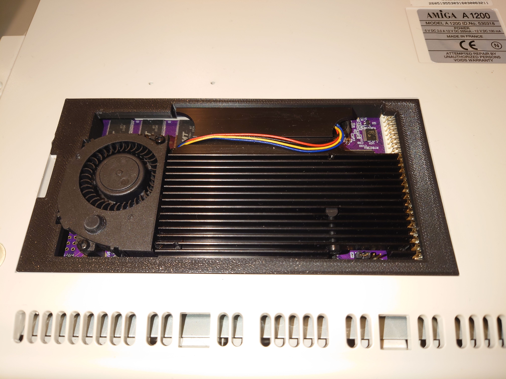
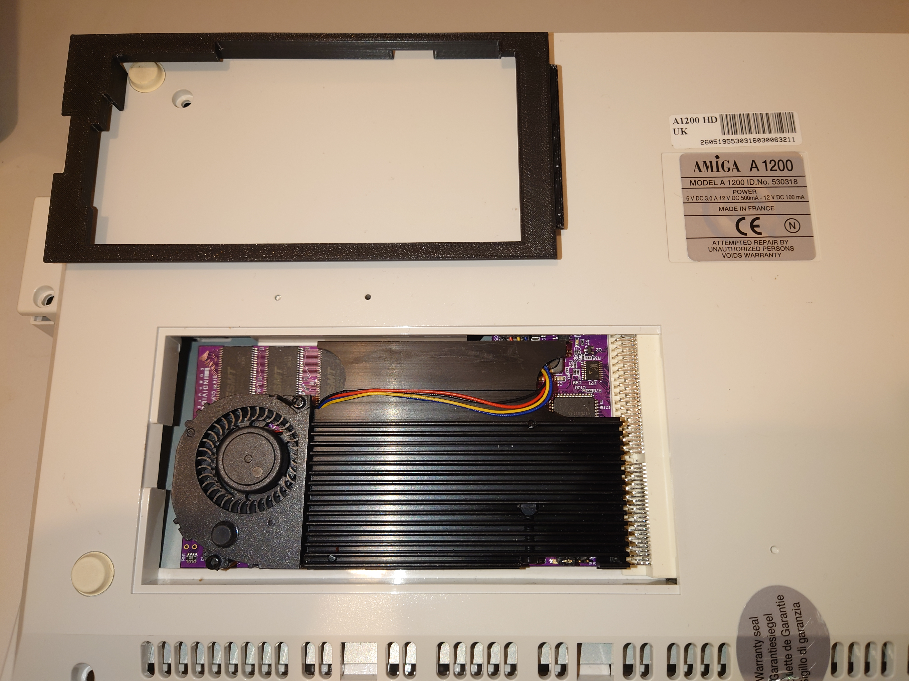
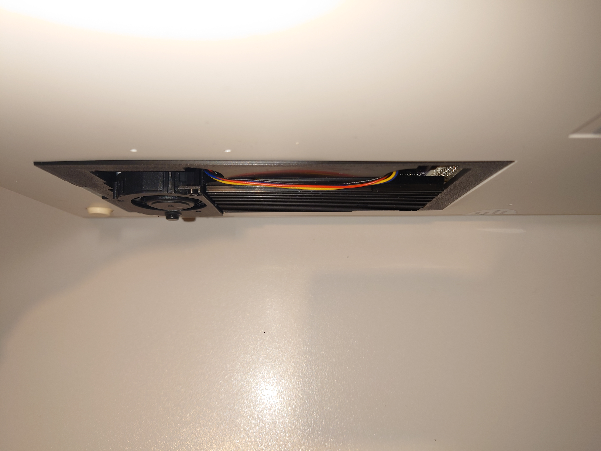
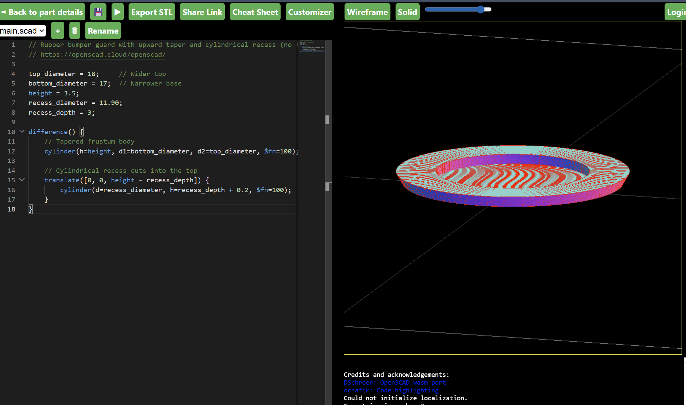
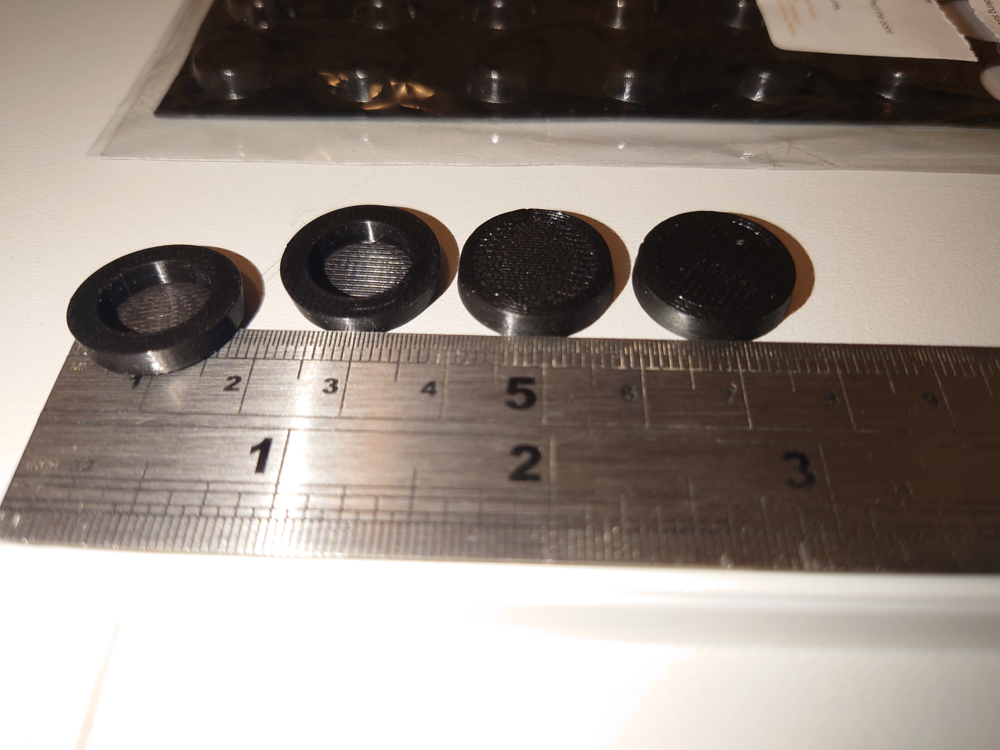
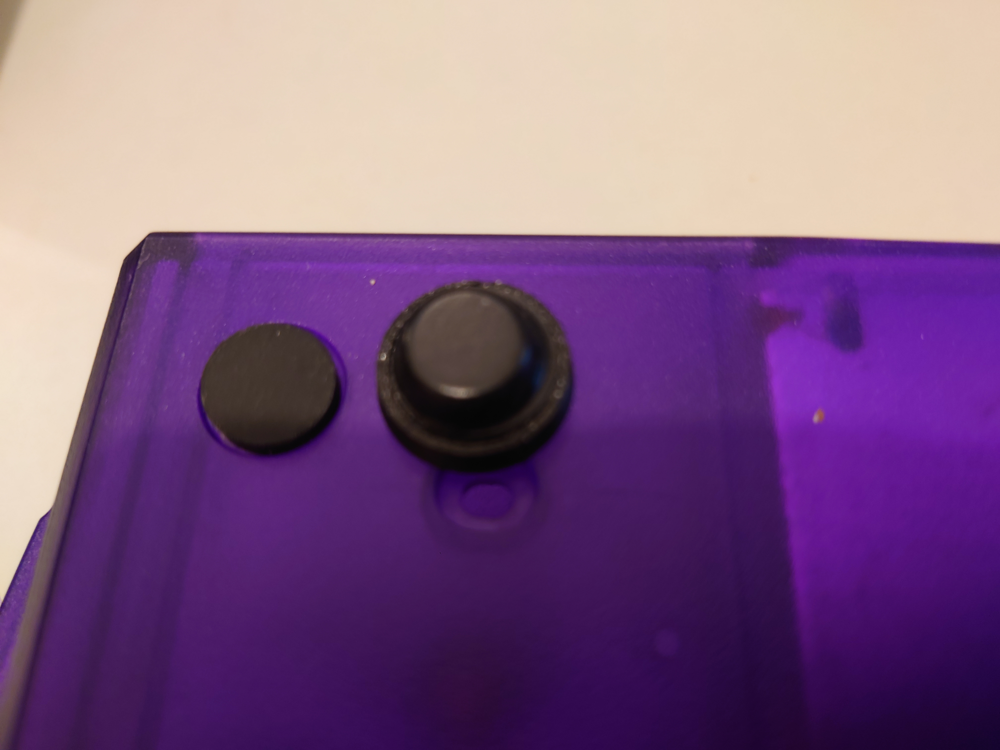
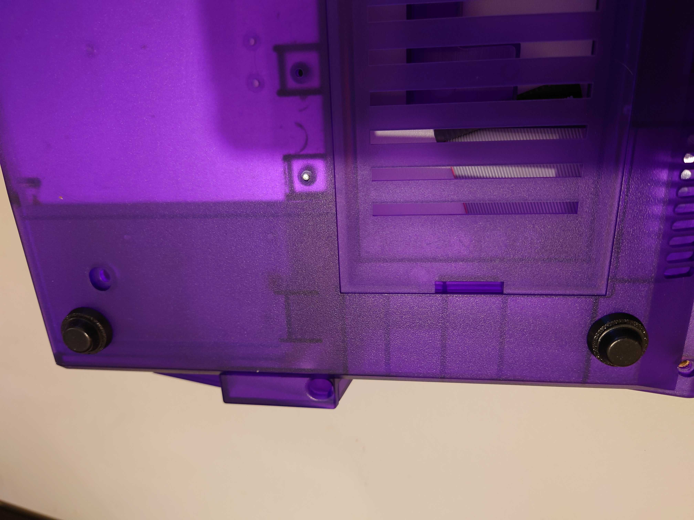
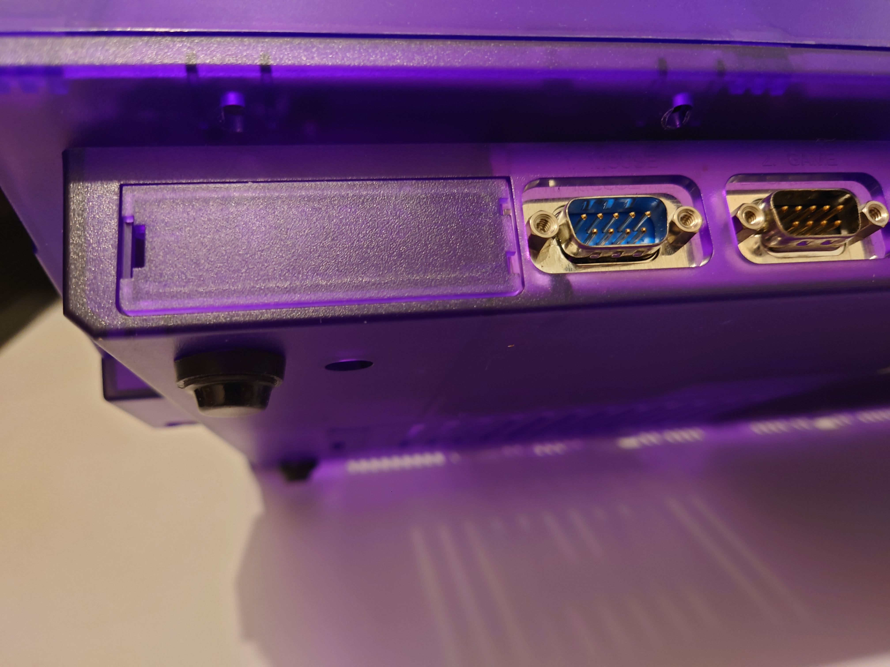
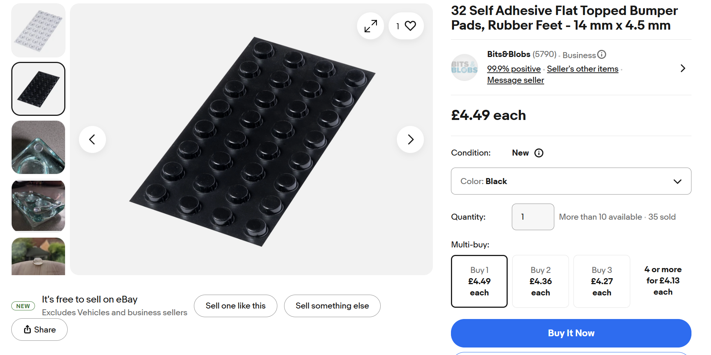

# Introduction

This folder contains a solution that provides support, via a modified trapdoor design, for the ACA 1240/1260 accelerator cards. It also includes a bespoke 3D printed feet adaptor solution for raising the A1200 case slightly higher to provide additional clearance and airflow for the card.

The modified trapdoor STL file can be found here:

[trap_door_a1200_aca1240.stl](trap_door_a1200_aca1240.stl)

- Here is a photo of the trapdoor deployed to the undercarriage of an Escom A1200 case:

  

- Here is another view with the trapdoor beside a fitted ACA1240:

  

- Finally, we have a view of the trapdoor facing down holding the ACA1240 in place:

  

The trapdoor pushes up on the ACA1240, which pushes back slightly, causing the trapdoor to bow along one edge. I will look into this further, but the trapdoor design so far seems functional. Please print out the trapdoor and suggest improvements. All recommendations are welcome.

## A1200 Cases 

### A1200.NET cases

The following SCAD file is a 3-D printed adaptor that connects to A1200.NET A1200 case feet, using friction, so the height increase is reversible without damage to the case or case feet (see below):

[a1200_net_3.5mm_11.90mm_without-flange.scad](a1200_net_3.5mm_11.90mm_without-flange.scad)

The SCAD file can be opened, and modified, using the following website which can also be used to generate an STL file for printing:

https://openscad.cloud/openscad/

Providing the adaptor in SCAD format allows individuals to experiment according to their own needs.

- Here is a photo of four 3D printed adaptors before rubber feet are attached to them:

  

- And here are the adaptors, with rubber feet attached, beside the factory fitted case feet for scale:

  

- Finally, we have some photos of the adaptors, with rubber feet, attached using friction over the original case feet:

  

  

### Commodore/Escom Cases

*Work in progress:* I am trying to find out if a friction-based adaptor will work. If not possible then a suitable adhesive could be used to attached the adaptors over the original feet. The adhesive that is applied to the rubber feet (from Ebay; see below) seems very suitable but I do not know how to source it. If you know please let me know.

## Rubber feet

Rubber feet (4 mm x 4.5 mm) were sourced from Ebay:

https://www.ebay.co.uk/itm/126010566451?var=426972244660

The adaptor is 3.5mm in height and the rubber feet are 4.5mm, with an overall height of 8mm which seems to be the minimum viable clearance.
